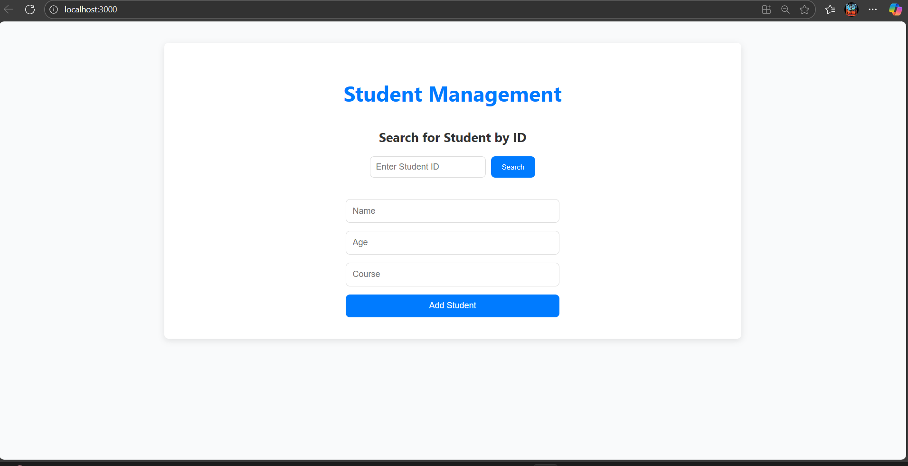
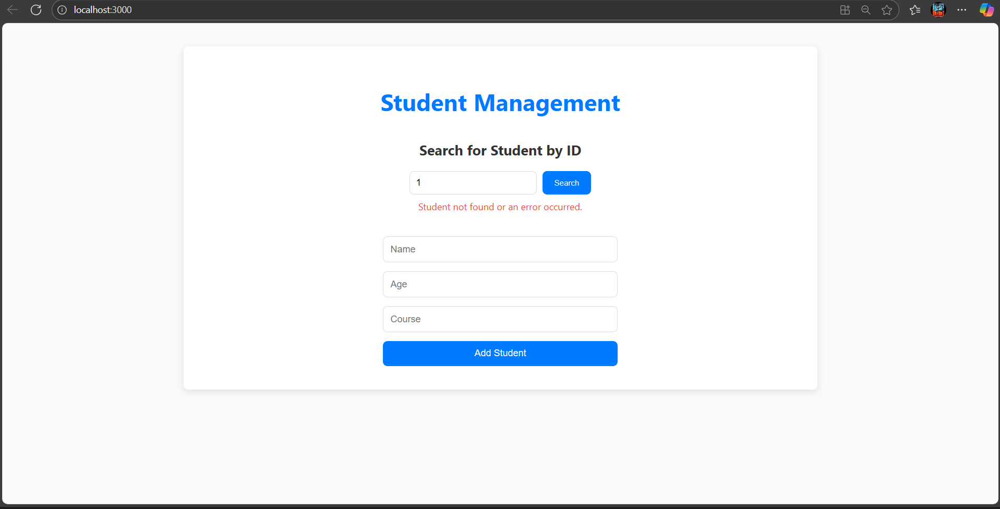
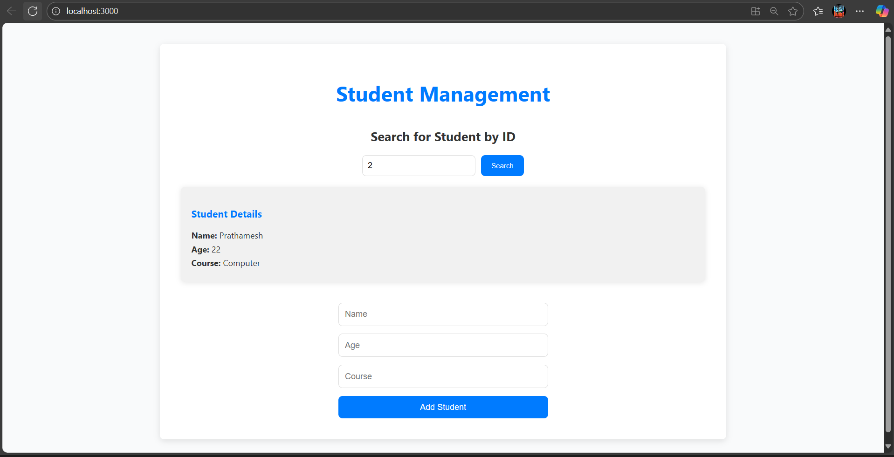
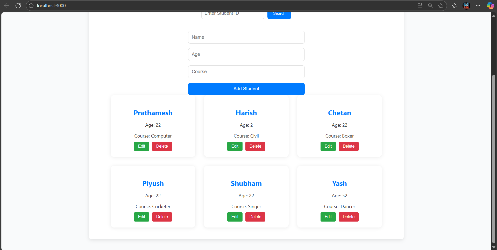
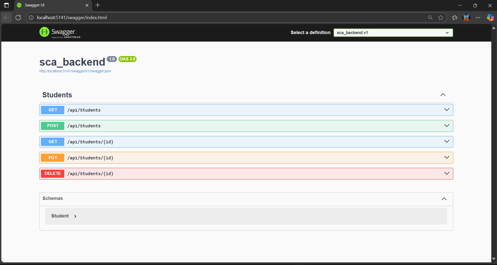

# Student CRUD Application

## Overview

The **Student CRUD Application** is a web-based application built using **React** for the frontend, **ASP.NET Core Web API** for the backend, and **Microsoft SQL Server** for database management. The application allows users to perform CRUD operations (Create, Read, Update, Delete) on student records.

In addition to the basic CRUD operations, the app includes a **Search by Student ID** feature to quickly find and view individual student details.

## Features

- **Create**: Add new student records with basic details (Name, Age, and Course).
- **Read**: View a list of all students, including their details.
- **Update**: Edit the information of an existing student.
- **Delete**: Remove a student from the system.
- **Search by ID**: Look up a specific student using their unique student ID.

## Tech Stack

- **Frontend**: 
  - React.js (JSX)
  - Axios for API calls
  - CSS for styling
- **Backend**:
  - ASP.NET Core Web API
  - ADO.NET for database interaction
  - Microsoft SQL Server for the database
- **Database**:
  - Microsoft SQL Server

## Requirements

### Backend

- **.NET 5 or higher**
- **SQL Server**

### Frontend

- **Node.js** (v14 or higher)
- **npm** or **yarn** (for package management)

---

## Setup & Installation

### Backend (ASP.NET Core Web API)

1. **Clone the repository**:

   ```bash
   git clone https://github.com/01Prathamesh/sca.git

2. **Navigate to the backend folder**:

    ```bash
    cd sca_backend


3. **Restore dependencies**:
    ```bash
    dotnet restore

4. **Set up the SQL Server database**:

    ```bash
    Create a new SQL Server database (you can use SQL Server Management Studio or any SQL client).

    Update the ConnectionString in appsettings.json to point to your database.

5. **Run the backend**:

    ```bash
    dotnet run
The API should now be running on http://localhost:5141.

### Frontend (React)

1. **Navigate to the frontend folder**:
    ```bash
    cd sca_frontend

2. **Install dependencies**:

    ```bash
    npm install

3. **Run the React app**:

    ```bash
    npm start

The React app should now be running on http://localhost:3000.

### Usage

## Usage

### Home Page:

When you open the application, you'll see the **Student Management** page with the following features:

- **Add Student Form**: Allows adding a new student with name, age, and course.
- **Student List**: Displays all students in a table. You can edit or delete each student.
- **Search by Student ID**: Use the search bar to look up students by their ID.

### Adding a Student:

- Enter the student's **Name**, **Age**, and **Course** in the form and click **Save**.

### Editing a Student:

- In the **Student List**, click **Edit** next to any student to update their details.

### Deleting a Student:

- In the **Student List**, click **Delete** next to any student to remove them from the system.

### Searching for a Student by ID:

- Use the **Search by Student ID** feature to enter a student ID and view their details.

---

## API Endpoints

Here is a list of the available API endpoints:

### 1. **Get All Students**
   - **Endpoint**: `GET /api/students`
   - **Description**: Retrieve a list of all students.
   - **Response**: A JSON array of student objects.

### 2. **Get Student by ID**
   - **Endpoint**: `GET /api/students/{id}`
   - **Description**: Retrieve details of a single student by their unique ID.
   - **Response**: A student object or a 404 error if not found.

### 3. **Create Student**
   - **Endpoint**: `POST /api/students`
   - **Description**: Add a new student.
   - **Request Body**:
     ```json
     {
       "name": "Prathamesh",
       "age": 25,
       "course": "Computer Science"
     }
     ```
   - **Response**: The newly created student object.

### 4. **Update Student**
   - **Endpoint**: `PUT /api/students/{id}`
   - **Description**: Update an existing student's information.
   - **Request Body**:
     ```json
     {
       "id": 1,
       "name": "Prathamesh",
       "age": 26,
       "course": "Data Science"
     }
     ```
   - **Response**: A 204 No Content response.

### 5. **Delete Student**
   - **Endpoint**: `DELETE /api/students/{id}`
   - **Description**: Delete a student by their unique ID.
   - **Response**: A 204 No Content response.

---

## Project Structure

### Backend

```bash
/backend
├── Controllers
│   └── StudentsController.cs  // API controllers for student operations
├── Data
│   └── StudentDAL.cs      // ADO.NET database helper
├── Models
│   └── Student.cs             // Student model class
├── appsettings.json           // Database connection settings
└── Program.cs                 // Entry point for ASP.NET Core application
```

### Frontend

```bash
/frontend
├── src
│   ├── components
│   │   ├── SearchStudent.jsx  // Search by student ID
│   │   ├── StudentForm.jsx    // Add/Edit student form
│   │   ├── StudentCard.jsx    // Shows the list of all Students
│   │   └── StudentList.jsx    // List of students with Edit/Delete actions
│   ├── services
│   │   └── api.js             // API functions for communicating with backend
│   ├── App.jsx                // Main App component
│   ├── App.css                // Styles for the app
│   └── index.js               // Entry point for React app
└── package.json               // Project dependencies

```

## Screenshots

Here are some screenshots of the application:

1. **Home Page**:
   

2. **Student Not Found**:
   

3. **Student Found**:
   

4. **Student List**:
   

5. **Swagger Backend**:
   
